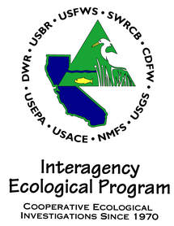

<!-- README.md is generated from README.Rmd. Please edit that file -->

# LTMRdata 

<!-- badges: start -->

[](https://github.com/sbashevkin/LTMRdata/actions)
<!-- badges: end -->

Integration of the Fall Midwater Trawl, Bay Study, and Suisun Marsh Fish
Study data for use in the IEP long-term monitoring survey review.

## Installation

You can install `LTMRdata` from [GitHub](https://github.com/) with:

``` r
# install.packages("devtools")
devtools::install_github("sbashevkin/LTMRdata")
```

# Usage

``` r
require(LTMRdata)
#> Loading required package: LTMRdata
```

## To access the individual source datasets

Suisun Marsh Fish Study

``` r
data(Suisun)
str(Suisun)
#> Classes 'tbl_df', 'tbl' and 'data.frame':    156029 obs. of  20 variables:
#>  $ Length      : num  126 135 130 85 90 100 95 78 127 113 ...
#>  $ Count       : num  1 1 1 1 1 1 2 1 1 1 ...
#>  $ Notes_catch : chr  NA NA NA NA ...
#>  $ Method      : chr  "Otter trawl" "Otter trawl" "Otter trawl" "Otter trawl" ...
#>  $ Station     : chr  "MZ2" "MZ2" "MZ2" "MZ2" ...
#>  $ Date        : POSIXct, format: "2013-12-04" "2013-12-04" ...
#>  $ Temp_surf   : num  11.8 11.8 11.8 11.8 11.8 11.8 11.8 11.8 11.8 11.8 ...
#>  $ Secchi      : num  49 49 49 49 49 49 49 49 49 49 ...
#>  $ Tide        : chr  "Flood" "Flood" "Flood" "Flood" ...
#>  $ Datetime    : POSIXct, format: "2013-12-04 13:03:00" "2013-12-04 13:03:00" ...
#>  $ Source      : chr  "Suisun" "Suisun" "Suisun" "Suisun" ...
#>  $ SampleID    : chr  "Suisun 1" "Suisun 1" "Suisun 1" "Suisun 1" ...
#>  $ Longitude   : num  -122 -122 -122 -122 -122 ...
#>  $ Latitude    : num  38.1 38.1 38.1 38.1 38.1 ...
#>  $ Depth       : num  6.4 6.4 6.4 6.4 6.4 6.4 6.4 6.4 6.4 6.4 ...
#>  $ Tow_duration: num  10 10 10 10 10 10 10 10 10 10 ...
#>  $ Notes_tow   : chr  NA NA NA NA ...
#>  $ Tow_area    : num  2007 2007 2007 2007 2007 ...
#>  $ Taxa        : chr  "Morone saxatilis" "Morone saxatilis" "Hysterocarpus traskii" "Morone saxatilis" ...
#>  $ Sal_surf    : num  4.83 4.83 4.83 4.83 4.83 ...
```

Fall Midwater Trawl

``` r
data(FMWT)
str(FMWT)
#> Classes 'spec_tbl_df', 'tbl_df', 'tbl' and 'data.frame': 228639 obs. of  21 variables:
#>  $ Station         : chr  "070" "070" "070" "070" ...
#>  $ Method          : chr  "Midwater trawl" "Midwater trawl" "Midwater trawl" "Midwater trawl" ...
#>  $ Survey          : int  7 8 9 9 9 9 9 9 3 3 ...
#>  $ Temp_surf       : num  8.3 10 13.9 13.9 13.9 13.9 13.9 13.9 21.1 21.1 ...
#>  $ Secchi          : num  69 120 32 32 32 32 32 32 71 71 ...
#>  $ Secchi_estimated: logi  FALSE FALSE FALSE FALSE FALSE FALSE ...
#>  $ Cable_length    : num  NA NA NA NA NA NA NA NA NA NA ...
#>  $ Tide            : chr  "Flood" "Flood" "Ebb" "Ebb" ...
#>  $ Depth           : num  6.1 3.66 6.1 6.1 6.1 ...
#>  $ Date            : POSIXct, format: "1992-01-10" "1992-02-07" ...
#>  $ Datetime        : POSIXct, format: "1992-01-10 08:18:00" "1992-02-07 08:23:00" ...
#>  $ Tow_volume      : num  5908 6153 4705 4705 4705 ...
#>  $ Tow_direction   : chr  "With current" "With current" "Against current" "Against current" ...
#>  $ Latitude        : num  38.2 38.2 38.2 38.2 38.2 ...
#>  $ Longitude       : num  -122 -122 -122 -122 -122 ...
#>  $ SampleID        : chr  "FMWT 1" "FMWT 2" "FMWT 3" "FMWT 3" ...
#>  $ Length          : num  NA NA 55 57 69 66 61 282 75 71 ...
#>  $ Taxa            : chr  NA NA "Oncorhynchus tshawytscha" "Oncorhynchus tshawytscha" ...
#>  $ Count           : num  NA NA 2 1 1 ...
#>  $ Sal_surf        : num  0.1018 0.0961 0.1163 0.1163 0.1163 ...
#>  $ Source          : chr  "FMWT" "FMWT" "FMWT" "FMWT" ...
```

Bay Study

``` r
data(Baystudy)
str(Baystudy)
#> Classes 'tbl_df', 'tbl' and 'data.frame':    746485 obs. of  22 variables:
#>  $ Survey       : int  1 1 1 1 1 1 1 1 1 1 ...
#>  $ Station      : chr  "101" "101" "101" "101" ...
#>  $ Method       : chr  "Midwater trawl" "Midwater trawl" "Midwater trawl" "Midwater trawl" ...
#>  $ Tow_duration : num  NA NA NA NA NA NA NA NA NA NA ...
#>  $ Notes_tow    : chr  NA NA NA NA ...
#>  $ Tow_direction: chr  NA NA NA NA ...
#>  $ Tow_volume   : num  5603 5603 5603 5603 5603 ...
#>  $ Tow_area     : num  NA NA NA NA NA NA NA NA NA NA ...
#>  $ Date         : POSIXct, format: "1980-01-23" "1980-01-23" ...
#>  $ Depth        : num  12.2 12.2 12.2 12.2 12.2 12.2 12.2 12.2 12.2 12.2 ...
#>  $ Secchi       : num  86 86 86 86 86 86 86 86 86 86 ...
#>  $ Temp_surf    : num  11.5 11.5 11.5 11.5 11.5 11.5 11.5 11.5 11.5 11.5 ...
#>  $ Latitude     : num  37.5 37.5 37.5 37.5 37.5 ...
#>  $ Longitude    : num  -122 -122 -122 -122 -122 ...
#>  $ Tide         : chr  NA NA NA NA ...
#>  $ Datetime     : POSIXct, format: "1980-01-23 07:49:00" "1980-01-23 07:49:00" ...
#>  $ SampleID     : chr  "Bay Study 1" "Bay Study 1" "Bay Study 1" "Bay Study 1" ...
#>  $ Taxa         : chr  "Atherinops affinis" "Atherinopsis californiensis" "Clupea pallasii" "Clupea pallasii" ...
#>  $ Length       : num  95 271 78 80 81 82 85 90 37 50 ...
#>  $ Sal_surf     : num  20.5 20.5 20.5 20.5 20.5 ...
#>  $ Source       : chr  "Bay Study" "Bay Study" "Bay Study" "Bay Study" ...
#>  $ Count        : num  1 1 2 2 1 1 1 2 1 1 ...
```

## To access the integrated dataset

``` r
Data <- LTMRpilot()
#> NOTE: Length data are not consistent across studies. Inspect the help files for Suisun, FMWT, and Baystudy before analysing lengths. Set quiet=TRUE to suppress this message.
str(Data)
#> tibble [1,131,153 x 25] (S3: tbl_df/tbl/data.frame)
#>  $ Length          : num [1:1131153] 126 135 130 85 90 100 95 78 127 113 ...
#>  $ Count           : num [1:1131153] 1 1 1 1 1 1 2 1 1 1 ...
#>  $ Notes_catch     : chr [1:1131153] NA NA NA NA ...
#>  $ Method          : chr [1:1131153] "Otter trawl" "Otter trawl" "Otter trawl" "Otter trawl" ...
#>  $ Station         : chr [1:1131153] "MZ2" "MZ2" "MZ2" "MZ2" ...
#>  $ Date            : POSIXct[1:1131153], format: "2013-12-04" "2013-12-04" ...
#>  $ Temp_surf       : num [1:1131153] 11.8 11.8 11.8 11.8 11.8 11.8 11.8 11.8 11.8 11.8 ...
#>  $ Secchi          : num [1:1131153] 49 49 49 49 49 49 49 49 49 49 ...
#>  $ Tide            : chr [1:1131153] "Flood" "Flood" "Flood" "Flood" ...
#>  $ Datetime        : POSIXct[1:1131153], format: "2013-12-04 13:03:00" "2013-12-04 13:03:00" ...
#>  $ Source          : chr [1:1131153] "Suisun" "Suisun" "Suisun" "Suisun" ...
#>  $ SampleID        : chr [1:1131153] "Suisun 1" "Suisun 1" "Suisun 1" "Suisun 1" ...
#>  $ Longitude       : num [1:1131153] -122 -122 -122 -122 -122 ...
#>  $ Latitude        : num [1:1131153] 38.1 38.1 38.1 38.1 38.1 ...
#>  $ Depth           : num [1:1131153] 6.4 6.4 6.4 6.4 6.4 6.4 6.4 6.4 6.4 6.4 ...
#>  $ Tow_duration    : num [1:1131153] 10 10 10 10 10 10 10 10 10 10 ...
#>  $ Notes_tow       : chr [1:1131153] NA NA NA NA ...
#>  $ Tow_area        : num [1:1131153] 2007 2007 2007 2007 2007 ...
#>  $ Taxa            : chr [1:1131153] "Morone saxatilis" "Morone saxatilis" "Hysterocarpus traskii" "Morone saxatilis" ...
#>  $ Sal_surf        : num [1:1131153] 4.83 4.83 4.83 4.83 4.83 ...
#>  $ Survey          : int [1:1131153] NA NA NA NA NA NA NA NA NA NA ...
#>  $ Tow_direction   : chr [1:1131153] NA NA NA NA ...
#>  $ Tow_volume      : num [1:1131153] NA NA NA NA NA NA NA NA NA NA ...
#>  $ Secchi_estimated: logi [1:1131153] NA NA NA NA NA NA ...
#>  $ Cable_length    : num [1:1131153] NA NA NA NA NA NA NA NA NA NA ...
```

# Code of Conduct

Please note that the ‘LTMRdata’ project is released with a [Contributor
Code of Conduct](CODE_OF_CONDUCT.md). By contributing to this project,
you agree to abide by its terms.
